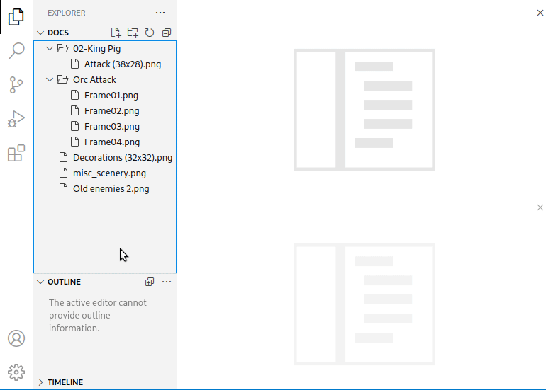

# Spright Visual Studio Code Extension

This extension provides an advanced editor for [Spright](https://github.com/houmain/spright#spright) configuration files.

- Files named `spright.conf` are automatically detected as _Spright Configuration_, for others it can be selected using _Change Language Mode_ . <kbd>Ctrl-K M</kbd>
- A graphical visualization of the configuration can be opened using _Show Spright editor panel_. <kbd>Ctrl-Shift-T</kbd>
- Sheet building can be triggered using _Build Spright output_. <kbd>Ctrl-Shift-B</kbd>
- Auto-completion of the configuration file can be triggered by _Complete Spright configuration_. <kbd>Ctrl-Shift-A</kbd>
- Image file and directories can be dropped on the editor to insert _input_ and _glob_ definitions.

Please see the [Spright reference](https://github.com/houmain/spright#spright) for details on how to write configuration files.

This clip shows the extension in action:

## License

**spright-vscode** is released under the GNU GPLv3. It comes with absolutely no warranty. Please see `LICENSE` for license details.

All image files are derived from files released as [CC0](https://creativecommons.org/publicdomain/zero/1.0/) on [OpenGameArt](https://opengameart.org).
